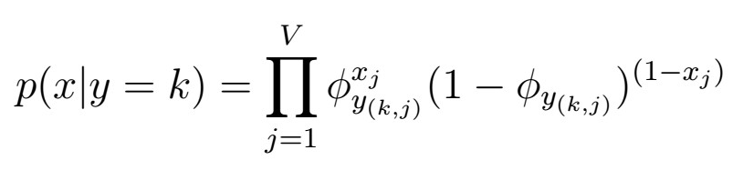
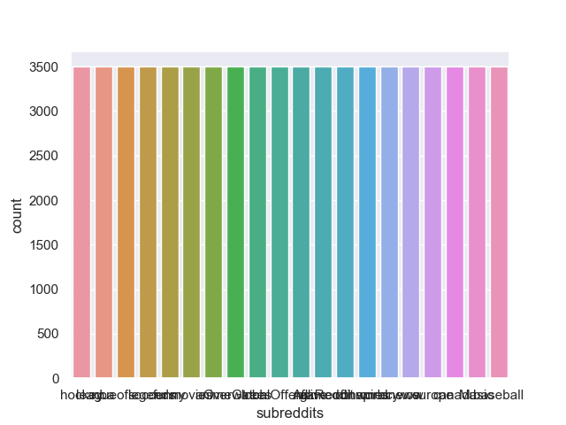
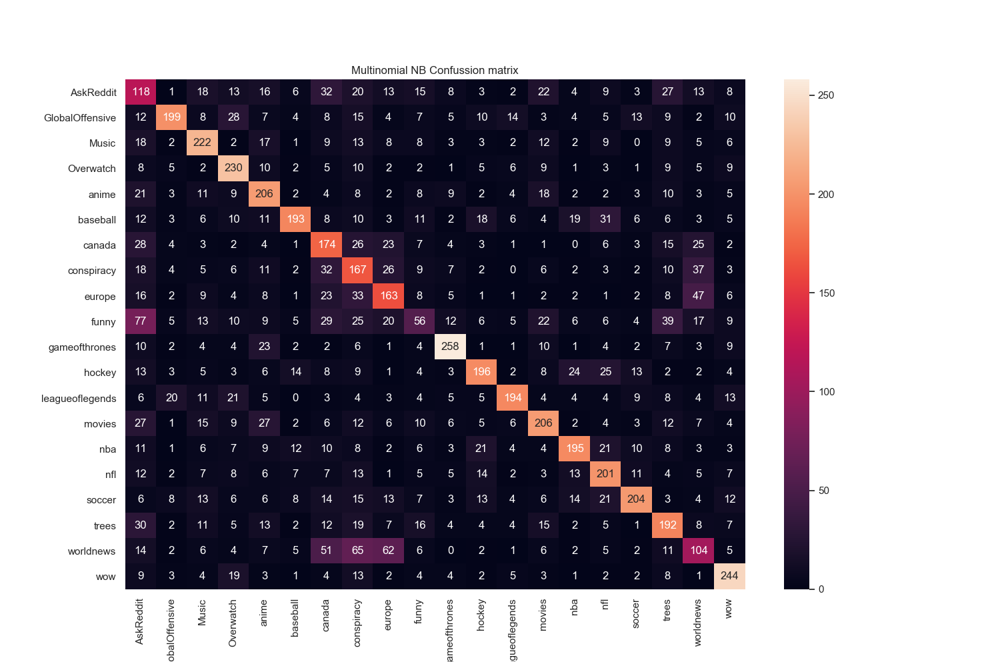

 Kaggle_Reddit_Multiclass_Classification by <a xmlns:cc="http://creativecommons.org/ns#" href="https://github.com/JairParra/Kaggle_Reddit_Multiclass_Classification" property="cc:attributionName" rel="cc:attributionURL">Hair Albeiro Parra Barrera</a> is licensed under a <a rel="license" href="http://creativecommons.org/licenses/by-nc-nd/4.0/">Creative Commons Attribution-NonCommercial-NoDerivatives 4.0 International License.</a>. Every unauthorized infraction will be legally prosecuted.

# Mini-Project 2: Kaggle Reddit multi-class classification
- Project for implementing multi-output classification of reddit data. 

## IMPORTANT/ANNOUNCEMENTS:  
- nltk/spacy basic usage &  preprocessing tutorial ready at "notebooks" 
- Ideally, we would like to have data pre-processing, Naive bayes implementation, 
as well as a fitted Pipeline with results by **next wednesday** We will then use the rest of the time 
to polish up and write-up the project. 
- Please check `issues`, consult  
- Our current best current classifier is **Multinomial Naive Bayes** and it's only accuracte to like 54% , which is utterly crap. We need to think of better features as well as perform hyperparameter tunning. 

## TASKS: 
-The following are the task divisions. These will be updated accordingly. 

### Jair: 
- Finish uploadin the nltk/spacy tutorials and setting up. **done**
- Data-preprocessing script and outputs. **in progress**
- Start implementing classification pipelines. **In progress**

### Ashray: 
- **Fix Naive Bayes running time issue/ finish implementation of other functions**
- Start working on improving classification pipelines and parameter Grid Parameter search
- Make kaggle group and join competiton (done)

### Hamza: 
- **Fix Naive Bayes running time issue/ finish implementation of other functions**
- Start working on improving classification pipelines and parameter Grid Parameter search 
- get added to the kaggle group (give ashray your username)

## Our paper: 
- https://www.overleaf.com/6192466927dckyydkjvmct

## Naive Bayes Formulation 
See https://sklearn.org/modules/naive_bayes.html
https://www.cs.ubc.ca/~murphyk/Teaching/CS340-Fall07/NB.pdf

## Dataset labels distribution  
- We observe that the labels have a very well balanced distribution. 

## Current Best Model: Scikit-learn Multinomial NB (Kaggle acc:54.6%, local cv acc: 54.43 %)

- **Note:** This accuracy comes from the artificially split training and testing sets we created, i.e., using the actual training and test data, we further split it into `X_train` (63000 samples), `X_test` (7000 samples), `y_train` (63000 samples) and `y_test`(7000) samples.  

 Kaggle_Reddit_Multiclass_Classification by <a xmlns:cc="http://creativecommons.org/ns#" href="https://github.com/JairParra/Kaggle_Reddit_Multiclass_Classification" property="cc:attributionName" rel="cc:attributionURL">Hair Albeiro Parra Barrera</a> is licensed under a <a rel="license" href="http://creativecommons.org/licenses/by-nc-nd/4.0/">Creative Commons Attribution-NonCommercial-NoDerivatives 4.0 International License.</a>. Every unauthorized infraction will be legally prosecuted.
