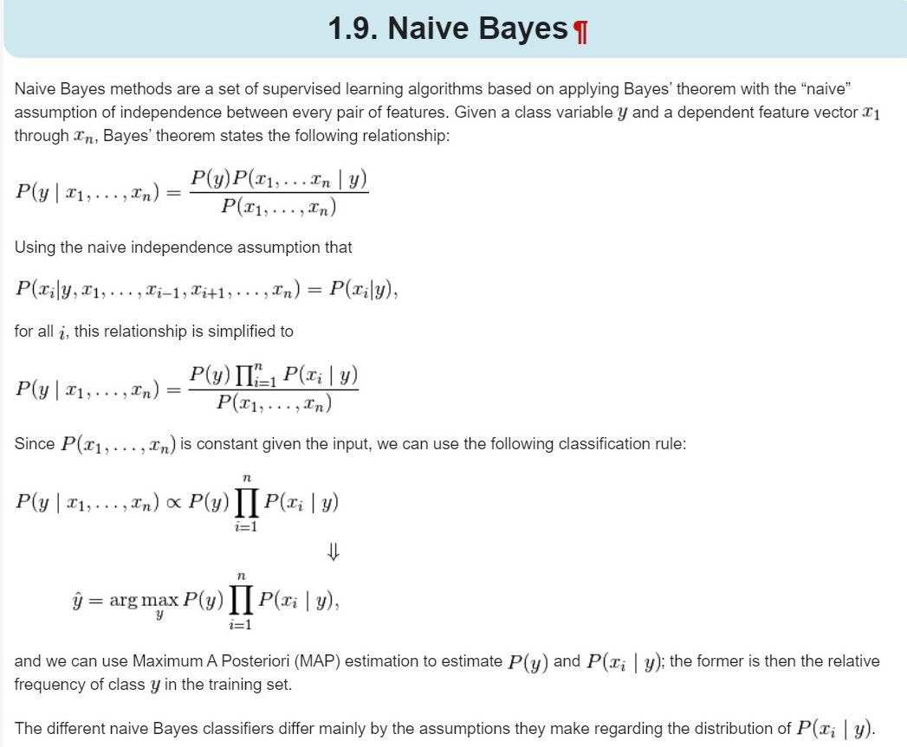
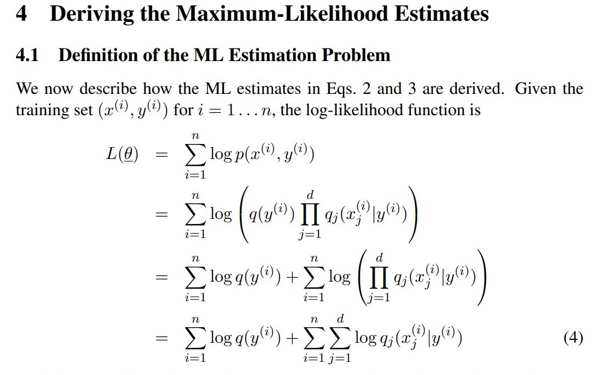
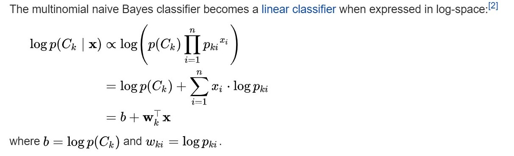

# Mini-Project 2: Kaggle Reddit multi-class classification
- Project for implmenting multi-output classification of reddit data. 

## IMPORTANT/ANNOUNCEMENTS:  
- Waiting for Group registration on MyCourses 
- Waiting for Kaggle registration after group registration on MyCourses (using MyCourses group name and mcgill emails) 

## TASKS: 
- Workload division; please update accordingly. 

### Jair: 
- Finish uploadin the nltk/spacy tutorials and setting up.
- Naive Bayes implementatio (compatible with sklearn). 

## Ashray: 
- Get to know how to use nltk, spacy, re 
- Figure out how to apply the preprocessing steps
- If there are any other cleaning steps, feel free to apply them and document them (what does it do, why this cleaning step) 
- Implement a function with parameters for the cleaning 

## Hamza: 
- Get to know how to use nltk, spacy, re 
- Figure out how to apply the preprocessing steps
- If there are any other cleaning steps, feel free to apply them and document them (what does it do, why this cleaning step) 
- Implement a function with parameters for the cleaning 

## Our paper: 
- https://www.overleaf.com/6192466927dckyydkjvmct

## Naive Bayes Formulation 
See https://sklearn.org/modules/naive_bayes.html

## Naive Bayes MLE formulation 
The following extact shows the log-likelihood formulation for the Multinomial Naive Bayes model 

## Naive Bayes is a linear classifier 

