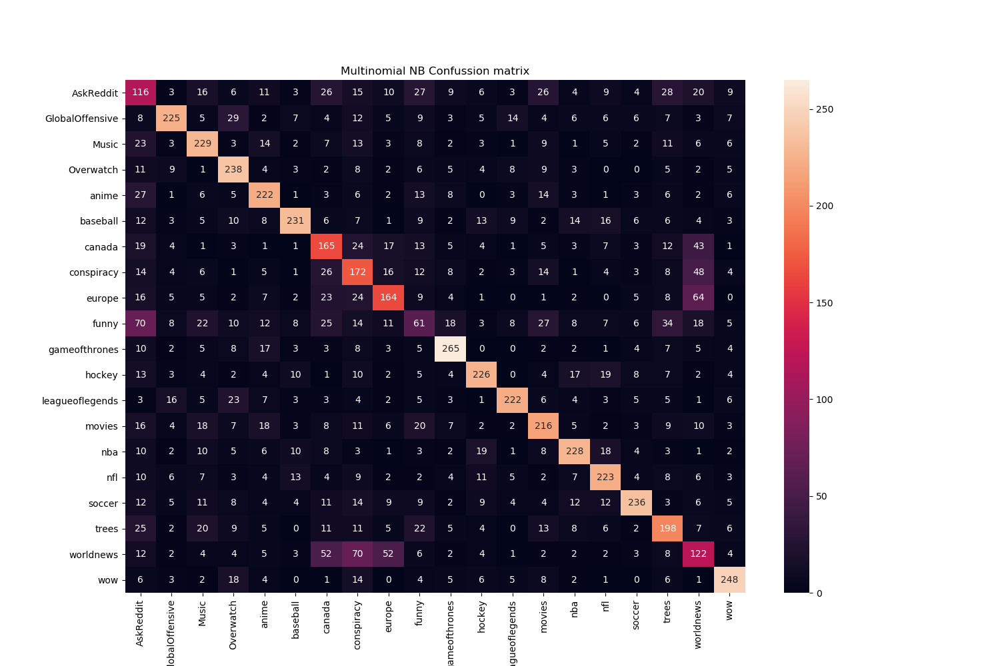

# Mini-Project 2: Kaggle Reddit multi-class classification
- Project for implementing multi-output classification of reddit data. 

## Our paper: 
- https://drive.google.com/file/d/1dRbLITMOx29PPVAf7L1EDnCv_AnGmk3J/view?usp=sharing

## Naive Bayes Formulation 
See
- https://sklearn.org/modules/naive_bayes.html
- https://www.cs.ubc.ca/~murphyk/Teaching/CS340-Fall07/NB.pdf

## Dataset labels distribution  
- We observe that the labels have a very well balanced distribution. 

## Current Best Model: Scikit-learn Linear SVC (Kaggle acc: 56.04,%, local cv acc: 55.43 %)

- **Note:** The following confussion matrices the original training data which we split it into `X_train` (63000 samples), `X_test` (7000 samples), `y_train` (63000 samples) and `y_test`(7000) samples.  Our second best model comes from the **Multinomial Naive Bayes classifier**. We display confussion matrices for both: 

